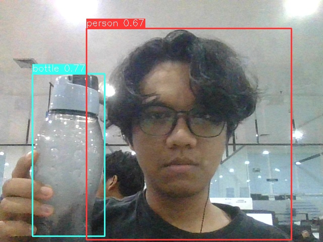

# **YOLO TensorRT C++ Inference**

This repository reuses inference code from the [TensorRT-YOLO](https://github.com/laugh12321/TensorRT-YOLO) repository.

## Tested Models:
- yolov8n.pt
- yolo11n.pt

## Test Environment:
- Operating System: Ubuntu 24.04.2 LTS
- Processor: 11th Gen Intel® Core™ i5-11400H × 12
- GPU: NVIDIA GeForce RTX™ 3050 Laptop GPU
- TensorRT Version: 10.4.0

Before starting inference, you will need a ``.engine`` file for the model. The general flow to get from a PyTorch model to the ``.engine`` file is as follows:

Flow:

``.pt`` → ``.onnx`` → ``.engine``

## Steps to Convert to ``.onnx`` and ``.engine``:
#### 1. Export the PyTorch model to ``.onnx``:
First, install the necessary package using pip:
```
pip install -U tensorrt_yolo
```

#### 2. Export the PyTorch Model to ``.onnx``:
Once the package is installed, you can convert your ``.pt`` model to ``.onnx``using the following command:
```
trtyolo export -w models/yolo11n.pt -v yolo11 -o models -s
```
This command will export your PyTorch model (yolo11n.pt) to an ONNX model and save it to the models directory.

#### 3. Convert the ``.onnx`` model to ``.engine``:
Once you have the ``.onnx`` file, you can convert it to a TensorRT ``.engine`` file using the following command:
```
trtexec --onnx=models/yolo11n.onnx --saveEngine=models/yolo11n.engine --fp16
```
This will generate the optimized .engine file, which you can use for inference. The --fp16 flag enables FP16 precision, which is recommended for performance optimization.

For more detailed information and examples, please refer to the official [TensorRT-YOLO](https://github.com/laugh12321/TensorRT-YOLO) repository.

## Building the Project
Before building, make sure to update the ``CMakeLists.txt`` with the correct TensorRT path.

Then, run the following commands:
```
mkdir build
cd build
cmake ..
make
```
## Run the Code
After building the project, the executable will be located in the ``bin/`` directory.

#### Quick Start (Default)
You can run the inference with default parameters using:
```
./detection
```
> ⚠️ Note: This may result in an error if the required engine file or other defaults are missing or incorrect. Make sure to adjust the command-line parameters or modify the defaults in the source code as needed.

#### View All Available Options
To see the full list of configurable parameters, run:
```
./detection --help
```
##### Command-Line Options : 
```
Usage: ./detection [OPTIONS]
Options:
  --engine PATH       Path to the TensorRT model engine file.
  --labels PATH       Path to the labels file.
  --threshold VALUE   Confidence threshold for object detection.
  --camera ID         Camera device ID (default: 0).
  --video PATH        Use video file instead of camera.
  --save              Save inference video to ../output/. Press 'S' to save current frame as an image in ../output/.
  --resolution W H    Set camera resolution (default: 640x480).
  --help              Show this help message.

```

#### Example Usages
Inference on Video File:
```
./detection \
  --engine ../models/yolo11n.engine \
  --labels ../models/labels.txt \
  --video ../sample3.mp4 \
  --threshold 0.4 \
  --save 
```
Inference with Live Camera:
```
./detection \
  --engine ../models/yolo11n.engine \
  --labels ../models/labels.txt \
  --camera 1 \
  --threshold 0.4 \
  --save \
  --resolution 1280 720
```

## Result Example

